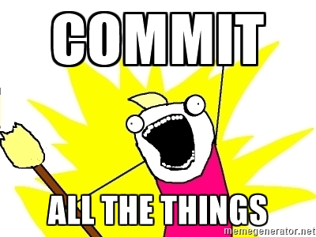

Commit All The Things (CATT)
============================
CATT will jump into all subdirectories, run `git status`, add all changes to a commit if desired, and then pushes the commit to all remotes.

TL;DR
------
I'm lazy; I figure push out all the data and deal with it later

Version Notes
-------------
- 0.1.0 - First Commit(s)
- 0.2.0 - Now will Args! (more importantly ... an installer)
- 0.2.1 - Now will an updater!
- 0.2.2 - Now will an updater that works!
- 0.2.3 - Decided to push/pull all; not just master
- 0.2.4 - Decided to push/fetch* all; not just master

